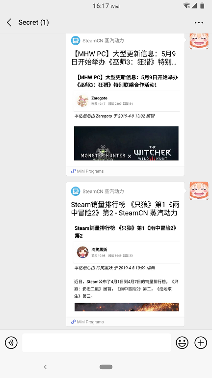

# SteamCN-Mini-Program
This is an Unofficial SteamCN forum WeChat mini program. It can let you read SteamCN threads on your phone.(WeChat required)

## Core Feature
- Read forum threads
- List recent threads
- List recent hot threads
- List newest replied threads
- View threads in each sections

## Scan QR code with WeChat

## ScreenShots
### Home

### Thread Preview

### Section

### Share in WeChat

## Feedback

More Plans at: https://github.com/xPixv/SteamCN-Mini-Program/issues/3

Feedback in issue: https://github.com/xPixv/SteamCN-Mini-Program/issues

## License
This project released under the [MIT License](https://github.com/xPixv/SteamCN-Mini-Program/blob/master/LICENSE)

## Open source Credit ❤

- [Taro](https://github.com/NervJS/taro) —— MIT
- [wxParse](https://github.com/icindy/wxParse) —— MIT
- [node-html-parser](https://github.com/taoqf/node-html-parser) —— Unlicensed
- SteamCN Forum and SteamCN App resources
